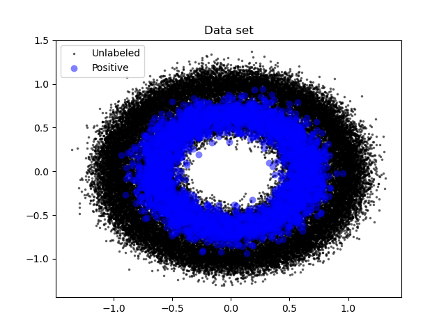
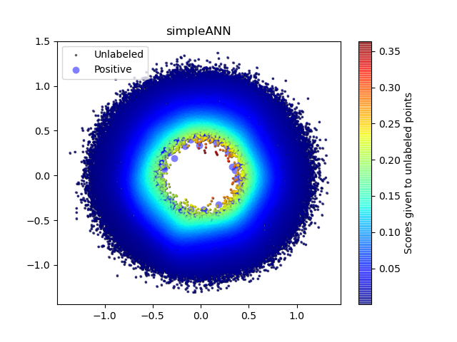
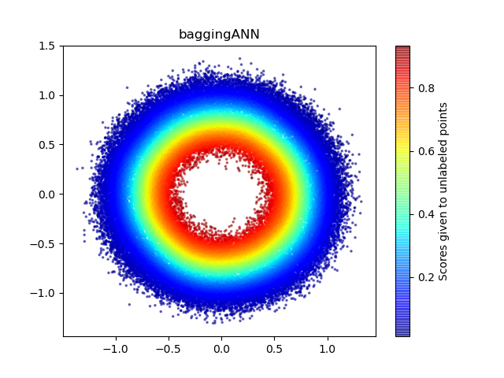

# BaggingANN

## Input arguments

```
--deveice 1
# 1. make dataset
--data_style circles, moons, blobs
--n_samples 60,000
--n_positives 3,00
# 2. train model
--num_iters 10
--num_epochs 10
--batch_size 100
--bagging size = 1 # the number of bootstrap (multiple of positive)
```

## example

Dataset (circles)



Result of simple ANN



Result of BaggingANN



